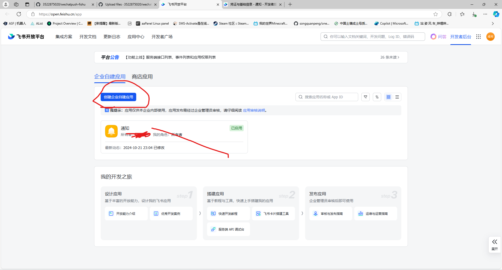
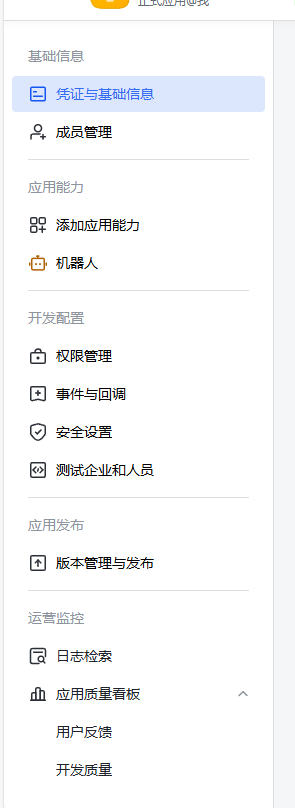
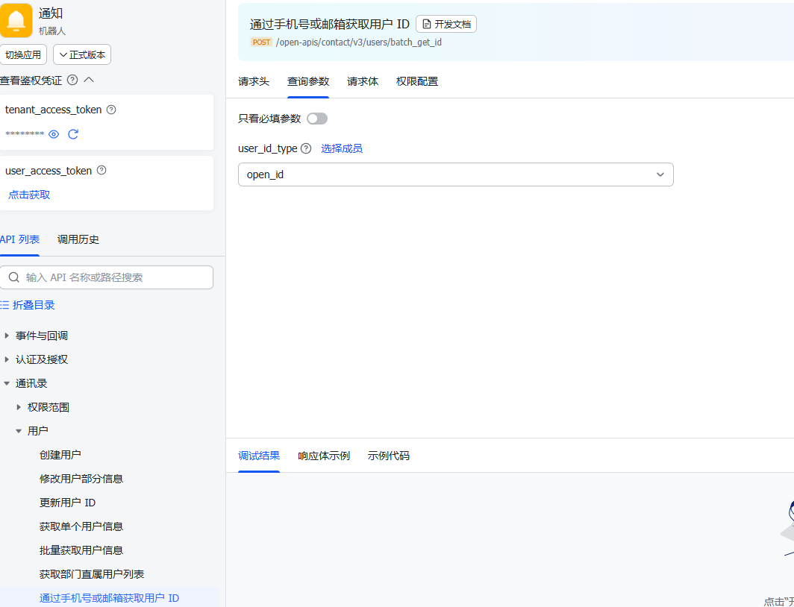

这是一个基于 `itchat` 库和 Flask 的 WeChat 推送应用程序。该应用程序允许用户通过微信发送和接收消息，包括处理各种消息类型，如文本、图片、视频等。

## 功能

* 向特定用户发送消息。
* 获取用户信息。
* 处理传入消息，包括文本、图片、视频等。
* 支持群聊消息。
* 在终端显示登录二维码。

## 需求

* Python 3.x
* Flask
* itchat
* waitress

## 安装

1. 克隆仓库：

    ```bash
    git clone https://github.com/yourusername/WeChatPush.git
    cd WeChatPush
    ```
2. 创建虚拟环境（可选但推荐）：

    ```bash
    python -m venv .venv
    ```
3. 激活虚拟环境：

    * 在 Windows 上：

      ```bash
      .venv\Scripts\activate
      ```
    * 在 macOS/Linux 上：

      ```bash
      source .venv/bin/activate
      ```
4. 安装所需的包：

    ```bash
    pip install -r requirements.txt
    ```

## 使用方法

1. 运行应用程序：

    ```bash
    python main.py
    ```
2. 登录飞书开放平台
3. 创建企业自建应用

4. 进入权限管理开通aily:message:write,
    contact:user.employee:readonly,
    contact:user.employee_id:readonly,
    contact:user.id:readonly,
    event:ip_list,
    im:chat,
    im:chat:create,
    im:message,
    im:message:send_as_bot,
    im:resource,
    手机上审核通过
    
6. 进入

    复制App ID与App Secre，
7. 点击https://open.feishu.cn/api-explorer/

    
    选择成员中选择自己复制
8. 将所有参数填入itchat\config.py中
9. 运行应用程序：

    ```bash
       python main.py
    ```
10. 当提示时，使用微信应用扫描终端中显示的二维码以登录。


## 消息处理

该应用程序可以处理各种类型的消息，包括：

* 文本消息
* 图片
* 视频
* 语音消息
* 文件
* 红包
* 转账
* 聊天记录

## 贡献

欢迎贡献！请随时提交拉取请求或为任何建议或改进打开问题。

## 许可证

该项目根据 MIT 许可证进行许可 - 详见 [LICENSE](LICENSE) 文件。

## 鸣谢
* [WeChatPush](https://github.com/TSIOJeft/WeChatPush) - 一个基于itchat的微信消息接收端。
* [itchat](https://github.com/littlecodersh/itchat) - 一个用于微信的 Python 库。
* [Flask](https://flask.palletsprojects.com/) - 一个轻量级的 WSGI Web 应用程序框架。
